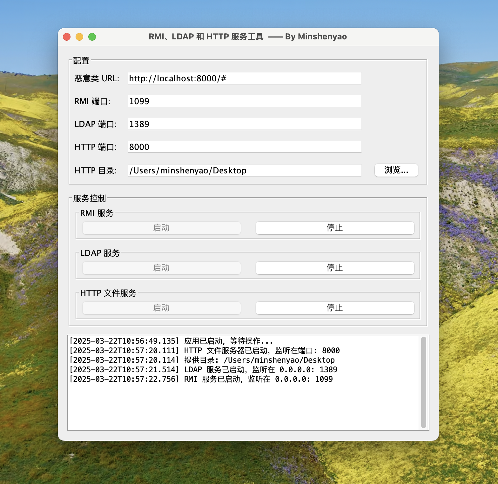

# JNDI注入测试工具

一个用于安全研究的JNDI注入测试工具，集成了RMI、LDAP和HTTP文件服务，提供图形界面进行统一管理。

## 功能特点

- **多服务集成**：同时支持RMI、LDAP和HTTP文件服务
- **简洁的GUI**：一体化的图形界面，方便操作和管理
- **实时日志**：GUI界面实时显示各服务运行日志
- **可配置参数**：支持修改各服务端口、恶意类URL等参数

## 截图



## 技术栈

- Java Swing (GUI)
- Java 内置HTTP服务器 (com.sun.net.httpserver)
- UnboundID LDAP SDK (LDAP服务)
- Java RMI (远程方法调用)

## 使用说明

### 前置条件

- JDK 8+
- Maven (用于构建项目)

### 配置

1. **恶意类URL**：指定要加载的远程类URL，格式为 `http://your-ip:port/#EvilClass`
2. **RMI端口**：RMI服务监听端口 (默认: 1099)
3. **LDAP端口**：LDAP服务监听端口 (默认: 1389)
4. **HTTP端口**：HTTP文件服务器监听端口 (默认: 8000)
5. **HTTP目录**：HTTP服务提供文件的目录路径

### 服务管理

- 分别点击各服务下的"启动"按钮启动对应服务
- 分别点击各服务下的"停止"按钮停止对应服务
- 应用退出时会自动停止所有运行中的服务

### 测试流程

1. 配置好恶意类URL，例如 `http://localhost:8000/#EvilClass`
2. 启动HTTP服务，确保恶意类能够通过HTTP访问
3. 启动RMI或LDAP服务
4. 使用受影响的应用连接到RMI或LDAP服务
5. 观察日志输出，验证注入是否成功

## 安全声明

**重要提示**：此工具仅用于安全研究、授权测试和教育目的。在未经授权的情况下对系统进行测试属于违法行为。请负责任地使用本工具。

## 构建

```bash
# 使用Maven构建
mvn clean package

# 运行
java -jar target/JNDIInjectorGUI-1.0-SNAPSHOT.jar
```

## 开发者

- [Minshenyao](https://github.com/Minshenyao)
